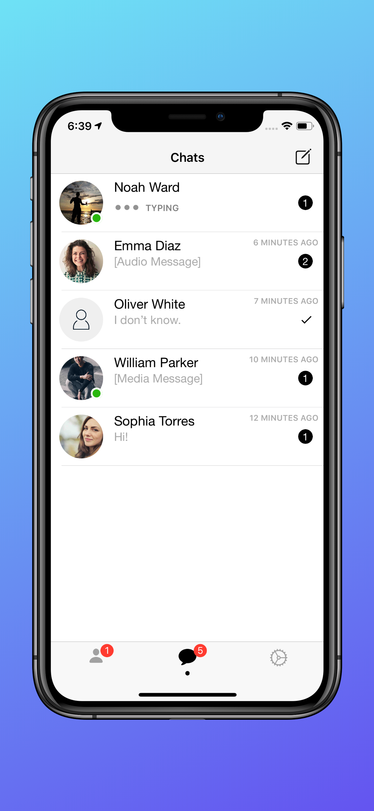
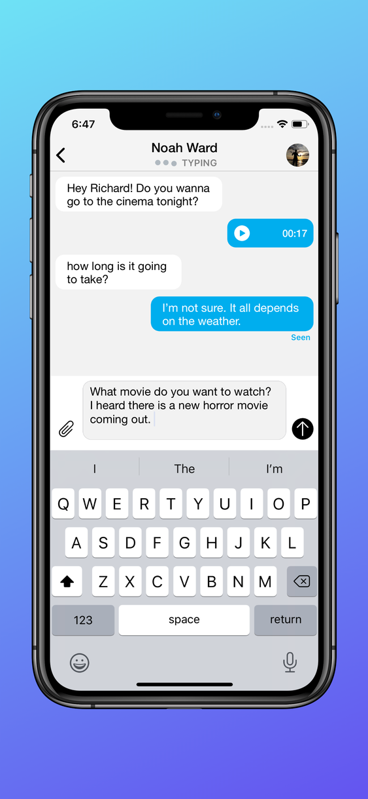
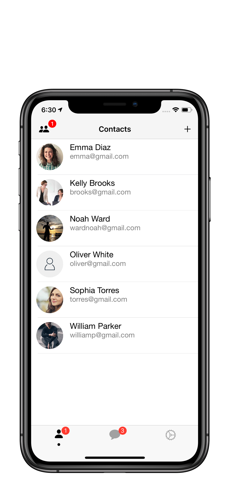
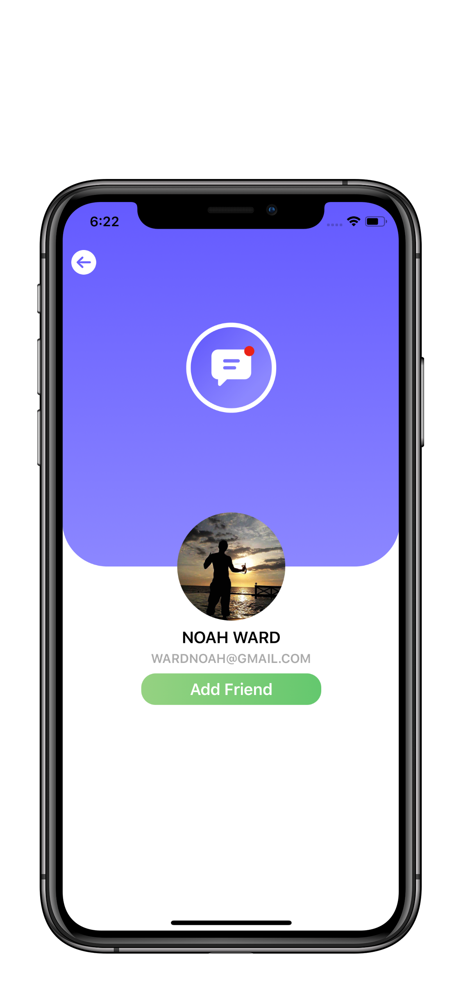
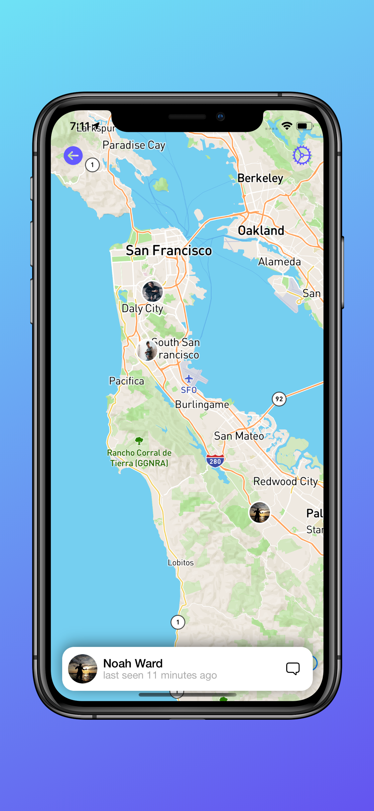
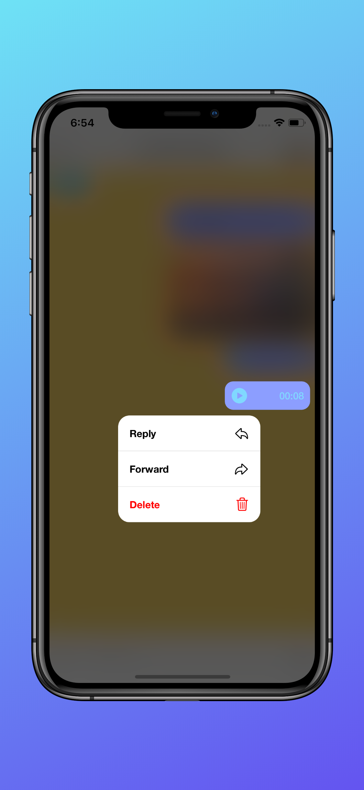

### General
**```mChat```** is a real-time messaging app written in Swift for iOS devices. Since mChat uses a fast and reliable [Firebase Database](https://firebase.google.com/docs/database), it receives data instantly, which makes a messaging process better among its users. Moreover, it uses a [Mapbox API](https://www.mapbox.com/) that provides different styles of the map, making it an unforgettable experience for users. The app design is inspired by Telegram Messenger.


### Demo

  
   

### Functionality


### How to install?


## License
```
Copyright 2020 VITALIY PALIY

   Licensed under the Apache License, Version 2.0 (the "License");
   you may not use this file except in compliance with the License.
   You may obtain a copy of the License at

       http://www.apache.org/licenses/LICENSE-2.0

   Unless required by applicable law or agreed to in writing, software
   distributed under the License is distributed on an "AS IS" BASIS,
   WITHOUT WARRANTIES OR CONDITIONS OF ANY KIND, either express or implied.
   See the License for the specific language governing permissions and
   limitations under the License.

```
