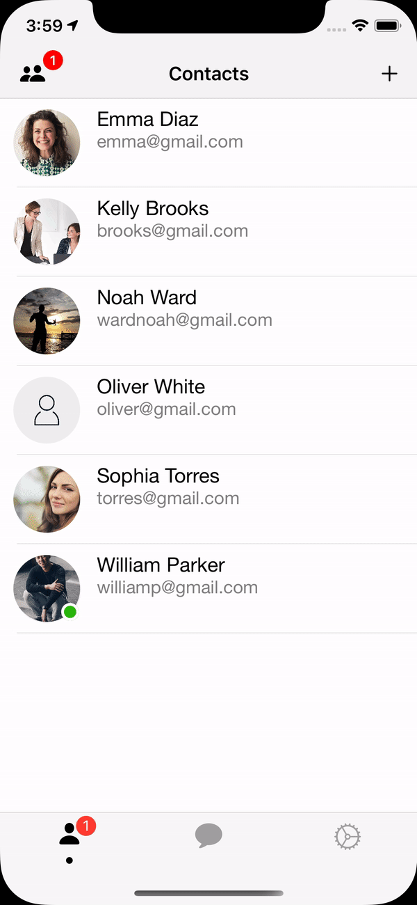
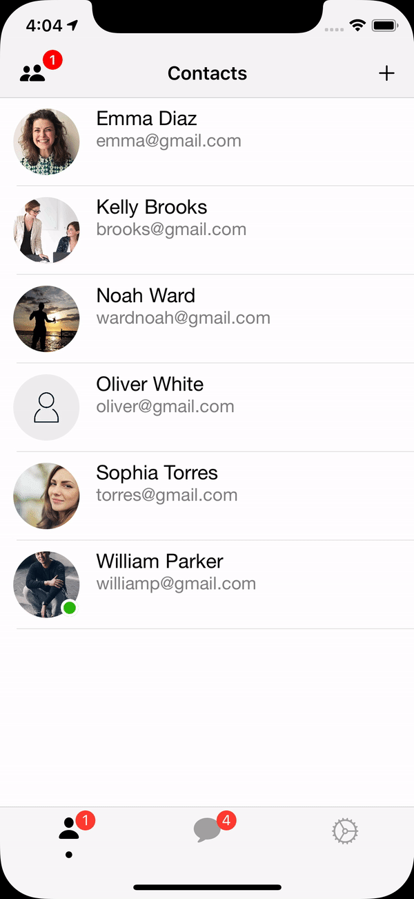

### General
**```mChat```** is a real-time messaging app written in Swift for iOS devices. Since mChat uses a fast and reliable [Firebase Database](https://firebase.google.com/docs/database), it receives data instantly, which makes a messaging process better among its users. Moreover, it uses a [Mapbox API](https://www.mapbox.com/) that provides different styles of the map, making it an unforgettable experience for users. The app design is inspired by Telegram Messenger.


### Demo


 


  

### Requirements
- Xcode version 11.2.1+
- Swift 5
- iPhone 8 or higher
- iOS 13.0+

### Functionality
- Real-time chat
- User online indicator
- Sending text messages
- Unlimited length of text messages
- Sending image messages
- Sending video messages
- Sending audio messages
- Typing indicator
- Messages status indicator
- Delete messages
- Reply to / Forward messages
- Custom chat design
- Friend network
- Locate friends on a map (if they have disabled an anonymous mode)
- Custom map design
- Change email / password
- Change profile image

### How to install?
1. Install CocoaPods -> [URL](https://guides.cocoapods.org/using/getting-started.html)
2. Open Terminal and run ```pod install``` directly in ```mChat/Messenger``` folder.
3. In order for Firebase to work, create a new project for your application. -> [URL](https://console.firebase.google.com/u/0/)
4. Download ```GoogleService-Info.plist``` from your newly created Firebase project and replace it with the old one. [screenshot](https://imgur.com/D4aBcEx)
5. Enable [Email/Password authentication method](https://firebase.google.com/docs/auth/web/password-auth)
6. Create [Realtime Database](https://firebase.google.com/docs/database/ios/start)
7. Set Realtime Database rules to:
```
{
  "rules": {
     ".read": true,
     ".write": true     
  }
}
```
8. Enable your Firebase [Storage](https://firebase.google.com/docs/storage)
9. For using Mapbox, create a new token -> [here](https://account.mapbox.com/)
10. Create a new key named ```MGLMapboxAccessToken``` in your ```Info.plist``` and insert access token as a value. [More Info](https://docs.mapbox.com/help/how-mapbox-works/access-tokens/#how-access-tokens-work)

  

### Credits
- Firebase -> [website](https://firebase.google.com/)
- Mapbox -> [website](https://www.mapbox.com/)
- Lottie -> [git](https://github.com/airbnb/lottie-ios)
- SkyFloatingLabelTextField -> [git](https://github.com/Skyscanner/SkyFloatingLabelTextField)
- IGColorPicker -> [git](https://github.com/iGenius-Srl/IGColorPicker)

## License
```
Copyright 2020 VITALIY PALIY

   Licensed under the Apache License, Version 2.0 (the "License");
   you may not use this file except in compliance with the License.
   You may obtain a copy of the License at

       http://www.apache.org/licenses/LICENSE-2.0

   Unless required by applicable law or agreed to in writing, software
   distributed under the License is distributed on an "AS IS" BASIS,
   WITHOUT WARRANTIES OR CONDITIONS OF ANY KIND, either express or implied.
   See the License for the specific language governing permissions and
   limitations under the License.

```
